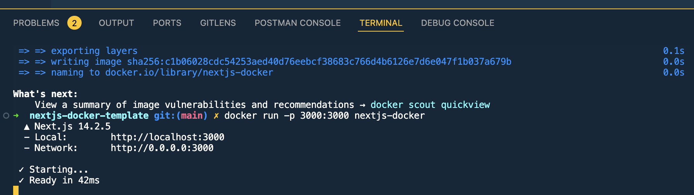

This is a [Next.js](https://nextjs.org/) project bootstrapped with [`create-next-app`](https://github.com/vercel/next.js/tree/canary/packages/create-next-app).

## Getting Started

The easiest way to get started with the project is by following the steps below

First, install the packages and run the development server

```bash
npm i && npm run dev
```

Open [http://localhost:3000](http://localhost:3000) with your browser to see the result.

You can start editing the page by modifying `app/page.tsx`. The page auto-updates as you edit the file.

## Running the app through docker

To run the application using Docker instead of using the dev command. Do the following

```bash
docker build -t nextjs-docker .
docker run -p 3000:3000 nextjs-docker
```

You should then see this


As you can see, open http://localhost:3000 with your browser to see the result.

One of the downside is you have to build and run the dockerfile to see the new changes that you make to the application. Not recommended for incremental development as auto-updates are a key for it.
